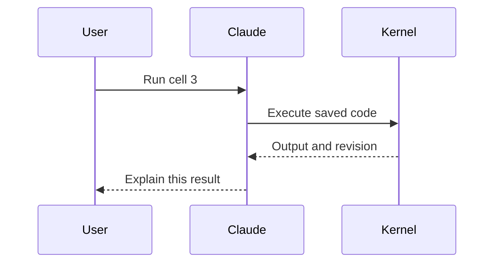
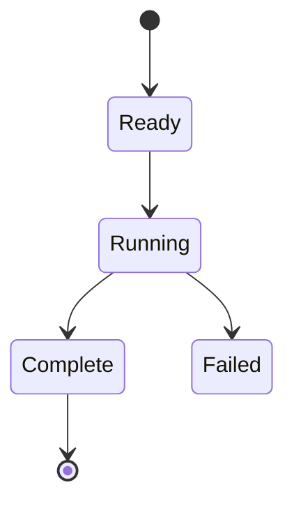
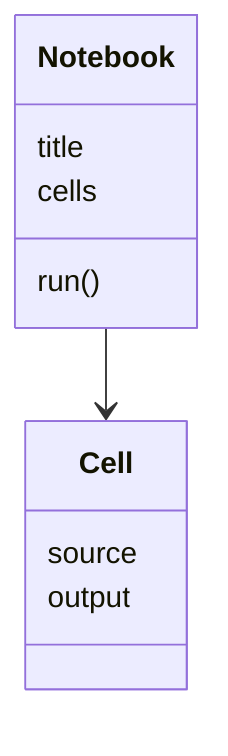
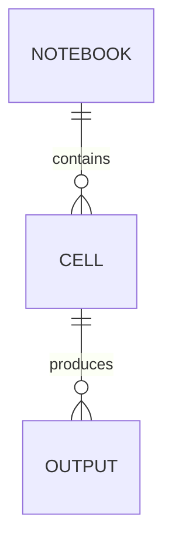

# Mermaid diagrams

```mermaid
sequenceDiagram
  participant User
  participant Claude
  participant Kernel
  User->>Claude: Run cell 3
  Claude->>Kernel: Execute saved code
  Kernel-->>Claude: Output and revision
  Claude-->>User: Explain this result
```

```mermaid
stateDiagram-v2
  [*] --> Ready
  Ready --> Running
  Running --> Complete
  Running --> Failed
  Complete --> [*]
```

```mermaid
classDiagram
  class Notebook {
    title
    cells
    run()
  }
  class Cell {
    source
    output
  }
  Notebook --> Cell
```

```mermaid
erDiagram
  NOTEBOOK ||--o{ CELL : contains
  CELL ||--o{ OUTPUT : produces
```
