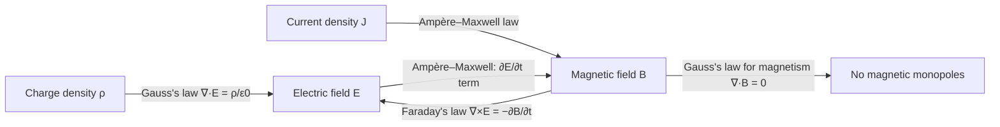

```mermaid
graph LR
  Q[Charge density ρ] -->|Gauss's law ∇·E = ρ/ε0| E[Electric field E]
  J[Current density J] -->|Ampère–Maxwell law| B[Magnetic field B]
  E -->|Ampère–Maxwell: ∂E/∂t term| B
  B -->|Faraday's law ∇×E = −∂B/∂t| E
  B -->|Gauss's law for magnetism ∇·B = 0| M[No magnetic monopoles]
```
